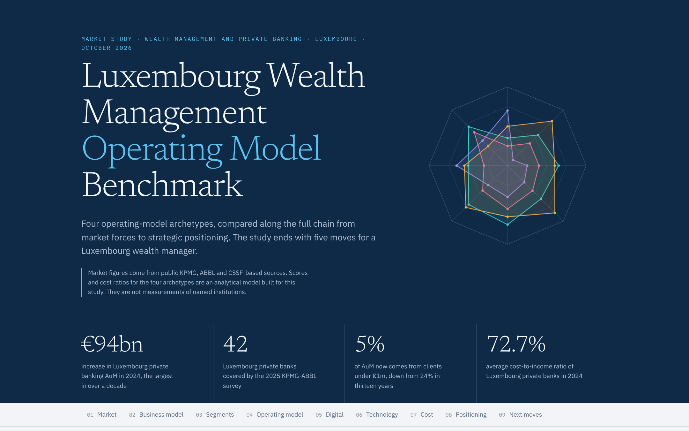
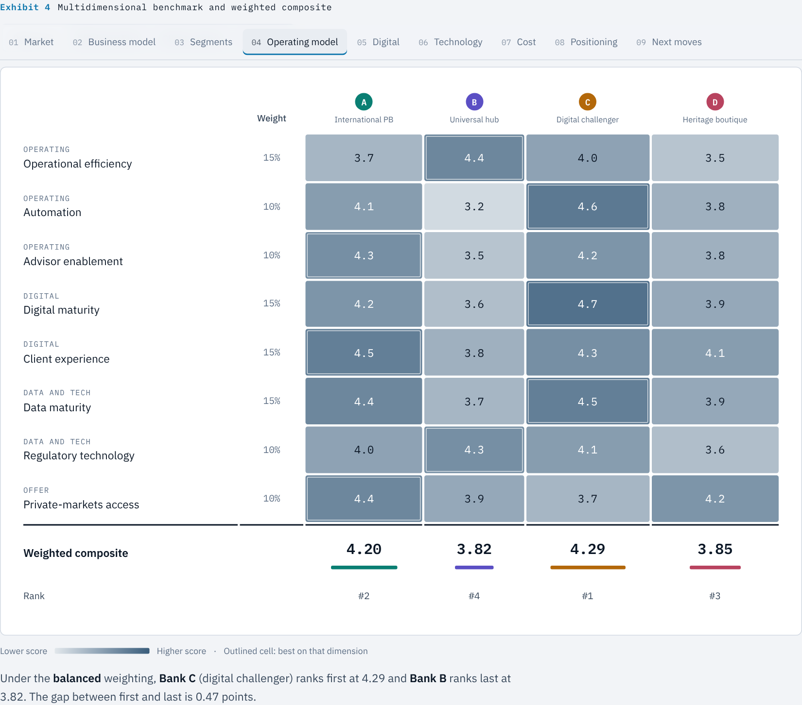
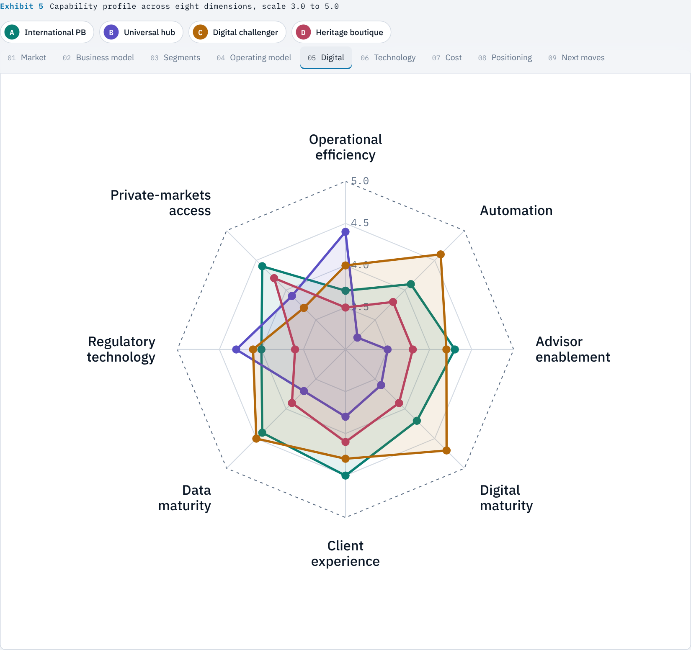
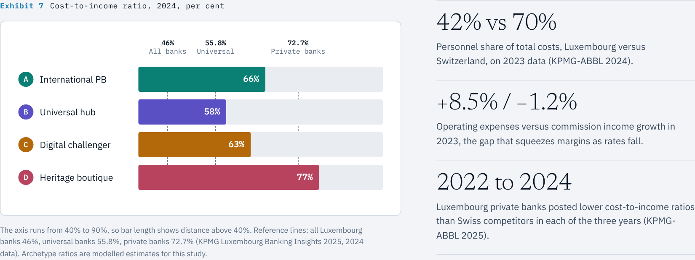
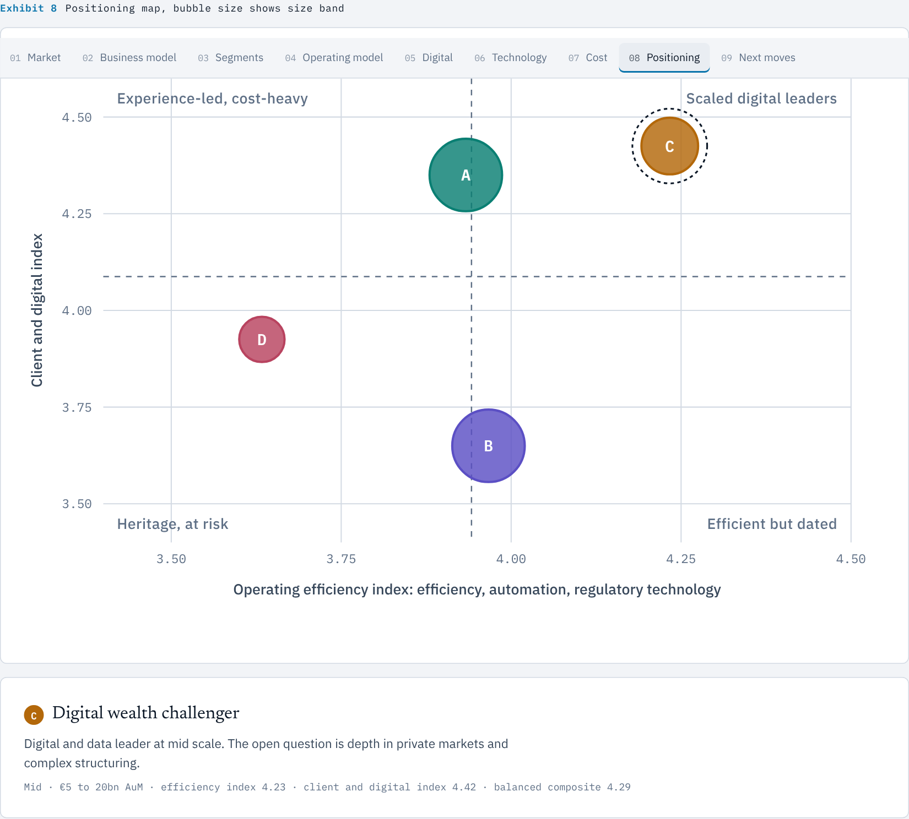

# Luxembourg Wealth Management Operating Model Benchmark

> A market study and multidimensional benchmark of four wealth management operating models in Luxembourg, ending with five strategic recommendations for a Luxembourg wealth manager.



**Live page:** [Open the interactive report](https://aishwaryamarkandu.github.io/luxembourg-wealth-benchmark/)

## What this is

An interactive, single-page consulting study. It follows the analysis chain a strategy team would use on a wealth management mandate:

```
Market → Business model → Client segments → Operating model
      → Digital capabilities → Technology → Cost / performance
      → Strategic positioning → Recommendations
```

It answers one question: **what should a Luxembourg wealth manager do next?**

## What is inside

| Section | What it shows |
|---|---|
| Market | Private banking AuM 2020 to 2024, five forces acting on the operating model |
| Business model | Four archetypes: international private bank, universal bank wealth hub, digital wealth challenger, heritage boutique |
| Client segments | Shift of AuM away from clients under €1m, segment fit by archetype |
| Operating model | Eight-dimension scorecard with four switchable weightings and a live ranking |
| Digital capabilities | Radar chart with per-archetype toggles, leads and gaps for each archetype |
| Technology | Technology stack fingerprint across six layers, including DORA resilience |
| Cost and performance | Cost-to-income ratio against public reference points |
| Strategic positioning | Positioning map on two composite indices |
| Recommendations | Five strategic moves, each tied to a measured gap, with a three-horizon roadmap |

## The five recommendations

1. **Industrialise the middle and back office.** Automation is the widest gap between archetypes.
2. **Go hybrid for the next generation.** Equip advisors, add a digital service tier for heirs.
3. **Make data the operating system.** One governed client view, controls for AI use.
4. **Open the private-markets shelf.** Remove the operational friction of alternatives.
5. **Pick a position, then partner or consolidate.** Scale, specialisation or digital leadership.

## Previews

| Scorecard | Capability radar |
|---|---|
|  |  |

| Cost and performance | Positioning |
|---|---|
|  |  |

The page follows the viewer's light or dark theme and works down to phone width.

## Data and method

- **Market figures are public.** They come from the KPMG-ABBL Private Banking Reports 2024 and 2025, KPMG Luxembourg banking insights 2025, ABBL publications and Paperjam. Every source is linked at the bottom of the page.
- **The four banks are archetypes, not real institutions.** Scores (scale 1 to 5), segment fit, technology fingerprints and cost-to-income ratios are an illustrative analytical model built for this study. They are not measurements of any named bank.
- **Weights are explicit.** The composite score is a weighted average of eight dimensions. Four weighting presets show how much the ranking depends on what a bank values most.
- **One derived figure.** The 2024 AuM bar (about €722bn) is the reported 2023 base plus the reported €94bn increase, and is drawn hatched to show it is derived.

## Run it

No build step. Open `index.html` in a browser.

```bash
git clone https://github.com/AishwaryaMarkandu/luxembourg-wealth-benchmark.git
cd luxembourg-wealth-benchmark
open index.html        # macOS; on Windows use: start index.html
```

The page loads three Google Fonts (Newsreader, IBM Plex Sans, IBM Plex Mono) and falls back to system fonts offline.

## Tech

One self-contained HTML file with vanilla JavaScript and inline SVG. No framework, no dependency, no build.

## Author

Built by **[Aishwarya](https://github.com/AishwaryaMarkandu)**, Business Analyst and PMO, as a personal portfolio project on financial services strategy and operating models.

## Disclaimer

This is an independent portfolio study. It is not affiliated with, or endorsed by, any bank, consultancy or professional body, and it is not investment advice.
